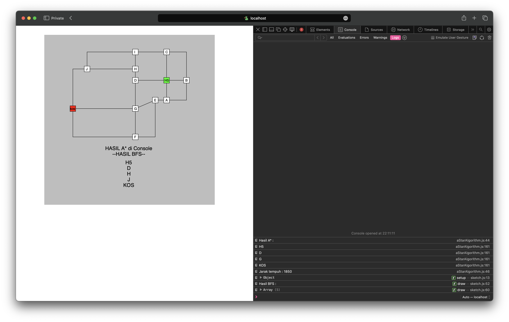

# Practice Assignments for A\* and BFS (Breadth First Search) Algorithms

### About this project

In this project the two algorithms above are described using the p5.js plugin to describe the path taken from Kos to H5.

### Test Results

### Algorithm Used

- A\* Algorithm
- BFS Algorithm

### References

- [A\* Algorithms](https://www.geeksforgeeks.org/a-search-algorithm/)
- [BFS Algorithms](https://www.geeksforgeeks.org/breadth-first-search-or-bfs-for-a-graph/)
